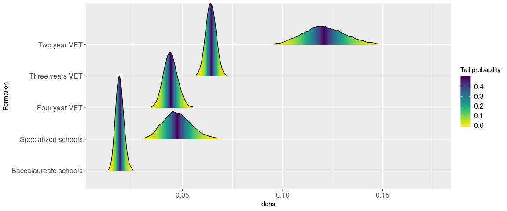
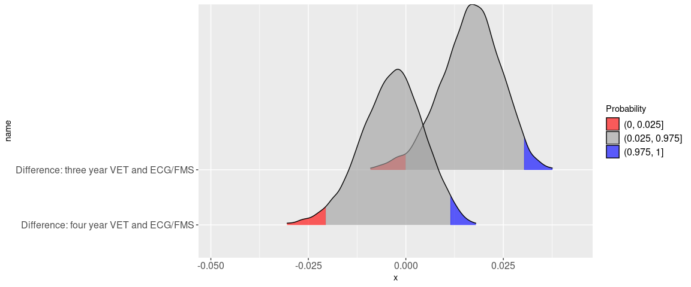

Model drop-out by education
===========================

We know how many students dropped out from education before 2016.

To better understand how these depend from the type of education at
entry in upper secondary degree, here we estimate a model in a bayesian
framework. With non informative priors.

The advantage of this approach is that:

-   you can use probability statements (for example: which is the
    probability than the drop-out rate of students in Three years VET is
    higher than that one of Specialized schools?)
-   natural to model multilevel structures (such as LABB and educational
    data).
-   possibility to model process generating missing informations.

We load the necessary packages:

    library(rethinking)
    library(viridis)
    library(ggridges)
    library(magrittr) # necessary
    library(dplyr)    # necessary
    library(tidyr)    # necessary
    library(sqldf)    # necessary
    library(knitr)    # optional (just for output)
    library(kableExtra) # optional (just for output)

First we : \* compute the dependent variable and the regressors
corresponding to each category of the **fsii\_e\_educType3** \* create a
little dataset containing the variables \* select a random sample (to
speed computations)

    eq1 <- readRDS(file = "erfolg_quote.rds")
    eq1 <- data.frame(eq1)
    ex <- eq1 %>% select(cert_det, fsii_e_eductype3)
    ex$y <- ifelse(ex$cert_det =="Left edu. < 2016", 1, 0)
    ex$twovet <- ifelse(ex$fsii_e_eductype3 == "Two years VET", 1, 0)
    ex$threevet <- ifelse(ex$fsii_e_eductype3 == "Three years VET", 1, 0)
    ex$fourvet <-  ifelse(ex$fsii_e_eductype3 == "Four years VET", 1, 0)
    ex$ecg <- ifelse(ex$fsii_e_eductype3 == "Specialized schools", 1, 0)
    ex$gm <- ifelse(ex$fsii_e_eductype3 == "Baccalaureate schools", 1, 0)

    ex <- ex %>% select(y, twovet, threevet, fourvet, ecg, gm)

    set.seed(1234567) # for reproducibility
    ex1 <- ex[sample(nrow(ex), 20000), ]
    ex1 <- data.frame(ex1)

Here we model the drop-out probability as a function of the education at
the entry of the upper secondary education.

The coefficients of the model (as in frequentist approach):

    precis(mod1) 

    ##     Mean StdDev  5.5% 94.5%
    ## a  -3.97   0.10 -4.13 -3.80
    ## b1  1.98   0.15  1.75  2.21
    ## b2  1.29   0.11  1.11  1.47
    ## b3  0.96   0.19  0.65  1.26
    ## b4  0.89   0.13  0.68  1.10

We sample from the posterior distribution of the model coefficients and
compute predicted probabilities:

    post <- extract.samples(mod1)
    post <- data.frame(post)
    head(post)

    ##           a       b1       b2        b3        b4
    ## 1 -3.943631 1.896254 1.226527 0.9526979 0.8889110
    ## 2 -3.970739 2.080407 1.298277 1.0276006 0.8828355
    ## 3 -4.135132 2.154410 1.444016 1.1198803 0.9572146
    ## 4 -3.914690 1.827533 1.283475 0.8500914 0.8086056
    ## 5 -3.944487 1.954921 1.213719 1.0176657 1.1454985
    ## 6 -4.081451 2.068869 1.419065 1.1499007 0.8581667

    drop_out_mg <- logistic(post$a)
    drop_out_twovet <- logistic(post$a + post$b1)
    drop_out_threevet <- logistic(post$a + post$b2)
    drop_out_ecg <- logistic(post$a + post$b3)
    drop_out_fourvet <- logistic(post$a + post$b4)

We can finally plot the drop-out probability

    Formation <- "Baccalaureate schools"
    ddmg <- data.frame(dens=drop_out_mg, Formation)

    Formation <- "Specialized schools"
    ddecg <- data.frame(dens=drop_out_ecg, Formation)

    Formation <- "Two year VET"
    ddtwovet <- data.frame(dens=drop_out_twovet, Formation)

    Formation <- "Three years VET"
    ddthree <- data.frame(dens=drop_out_threevet, Formation)

    Formation <- "Four year VET"
    ddfour <- data.frame(dens=drop_out_fourvet, Formation)

    data_dens <- rbind(ddmg, ddecg, ddfour, ddthree, ddtwovet)

    ggplot(data_dens, aes(x=dens, y=Formation, fill=0.5 - abs(0.5-..ecdf..))) +
      stat_density_ridges(geom = "density_ridges_gradient", calc_ecdf = TRUE,  rel_min_height = 0.01, scale=3) +
      scale_fill_viridis(name = "Tail probability", direction = -1) +
      theme(axis.text=element_text(size=12), legend.text=element_text(size=12))

    ## Picking joint bandwidth of 0.000736

 Here we
see that the students in two years VET education have higher probability
of drop-out rate, whereas students in general education this probability
is much lower. We see that there is a lot more of uncertainty in the
plausible parameters for the two years VET and students in specialized
schools.

Following this approach you can also answer questions by using
probability statements.

For exemple which is the probability that the drop-out rate of the
students in trhee years VET is higher than that of those of the
specialised schools:

    diff_dropout_tvet_ecg <- drop_out_threevet - drop_out_ecg
    sum(diff_dropout_tvet_ecg > 0) / length(diff_dropout_tvet_ecg)

    ## [1] 0.9738

Here we are sure that the difference between dropout rates of students
enrolled in three year education is higher than that one of students
from specialized schools.

Or you can test specific hypothesis, as which is the probability that
the difference in drop-out rate between students enrolled in four year
VET education with respect to students in specialized schools is higher
than 2%?

    diff_dropout_fvet_ecg <- drop_out_fourvet - drop_out_ecg
    (sum(diff_dropout_fvet_ecg > 0.02) / length(diff_dropout_fvet_ecg))*100

    ## [1] 0.05

We can see that there is 0.05% plausibility that the difference in
drop-out rates is higher than 2%.

We can also plot de posterior distribution of the differences of between
drop-out rates in specialized schools and VET education:

    name <- "Difference: three year VET and ECG/FMS"
    diff_dropout_tvet_ecg2 <- data.frame(x = diff_dropout_tvet_ecg, name)

    name <- "Difference: four year VET and ECG/FMS"
    diff_dropout_fvet_ecg2 <- data.frame(x= diff_dropout_fvet_ecg, name)

    data_all <- rbind(diff_dropout_fvet_ecg2, diff_dropout_tvet_ecg2)

    ggplot(data_all, aes(x=x, y=name, fill=factor(..quantile..))) +
      stat_density_ridges(geom = "density_ridges_gradient", calc_ecdf = TRUE, quantiles = c(0.025, 0.975),
                          rel_min_height = 0.01, scale=3) +
      scale_fill_manual(
        name = "Probability", values = c("#FF0000A0", "#A0A0A0A0", "#0000FFA0"),
        labels = c("(0, 0.025]", "(0.025, 0.975]", "(0.975, 1]")
      ) +
      theme(axis.text=element_text(size=12), legend.text=element_text(size=12))

    ## Picking joint bandwidth of 0.00112

 As for
the difference between three years VET and specialized schools, that
there is 98% probability that this difference is greater than 0.
Concerning the difference between four years VET and specialized
schools, here we see that 95% of the difference is between -0.02 and
0.012 and that the probability distribution does not even touch the
value of 2%.
